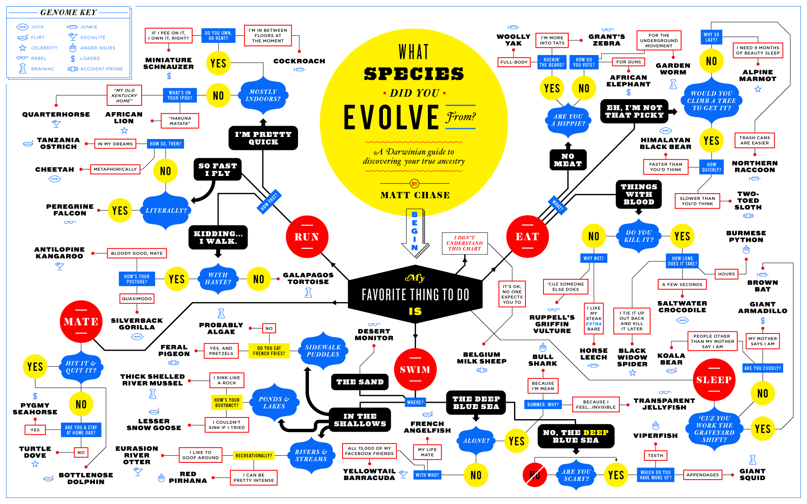

# Clips-Expert-System
A project for AI course.

Implementation of given guide map using Python and Clips.

## Contributors
* Szymon Kaczmarek 148056
* Adam Jurcz 144441

## To run

# Using executable file provided (from */dist*)
Run `./main`.

# Using python3 (from */src*)
Make sure you have installed all the required libraries.

Run `python3 src/main.py`.

## Libraries used
- PySimpleGUI
- Tkinter (tk) - PySimpleGUI depends on it
- ClipsPy